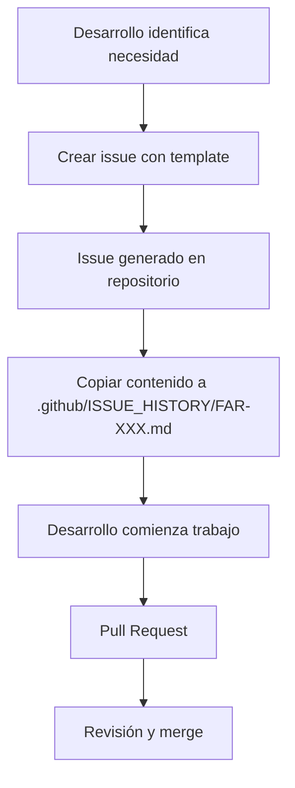

# Automatización de Issues - Farmacia Marketplace

## Introducción
Esta documentación explica el proceso de generación de una Issue técnica mediante una plantilla para que, una vez revisada, sea enviada al repositorio de GitHub para su creación.

## Estructura de Directorios

### 1. `.github/ISSUE_TEMPLATE/`
- **Contiene**: Plantillas maestras (plantillas por defecto de GitHub)
- **Regla**: Estos ficheros son **de solo lectura** durante el flujo de trabajo
- **Ejemplo**: `tecnica.yml` - template para tasks técnicas

### 2. `.github/ISSUE_HISTORY/`
- **Contiene**: Copias de todos los issues creados
- **Formato**: Archivos `.md` numerados `[FAR-XXX]`
- **Propósito**: 
  - Historial de decisiones técnicas tomadas
  - Referencia para futuras tareas similares
  - Auditoría de restricciones parafarmacéuticas aplicadas
  - Seguimiento de estimaciones vs. tiempo real

### 3. `.github/DOCUMENTATIONS/`
- **Contiene**: Documentación administrativa y procesos
- **Ejemplo actual**: `issue-automation.md`

## Plantillas Disponibles

### 1. Technical Task `[FAR-XXX]`
- **Ubicación**: `.github/ISSUE_TEMPLATE/tecnica.yml`
- **Propósito**: Tareas de arquitectura, calidad y configuración
- **Campos clave**:
  - Componente afectado (domain/application/adapters/config/BD/pom/docker/github)
  - Decisión técnica requerida
  - Estimación de horas
  - Validación de restricción parafarmacia

### 2. Flujo de Trabajo



3. Comandos de Lanzamiento
**Opción 1 - GitHub CLI:**

```bash
gh issue create --title "[FAR-001] Título descriptivo" \
  --template .github/ISSUE_TEMPLATE/tecnica.yml \
  --label "technical" --label "architecture" --label "triaged"
``` 

**Opción 2 - API curl:**

```bash
curl -X POST \
  -H "Authorization: token $GITHUB_TOKEN" \
  ... \
  -d '{"title":"[FAR-001] ...","template_name":"tecnica"}'
``` 

4. Convenios para el Proyecto
- Numeración: [FAR-001], [FAR-002], etc. (corresponde a issue número en GitHub)
- Etiquetas obligatorias: technical, architecture, triaged
- Validación previa: Checklist de restricción de medicamentos (ver AGENTS.md)
- Perfiles compatibles: dev/test/prod (ver sección Runtime Configuration)
- Paso post-creación: Copiar contenido issue a .github/ISSUE_HISTORY/FAR-XXX.md
---
